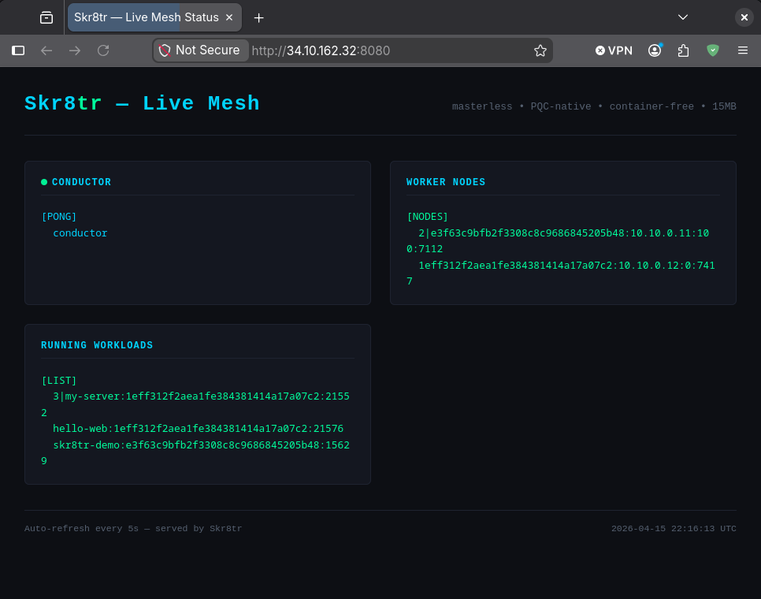

# Skr8tr — The Sovereign Orchestrator

**Masterless. PQC-native. Container-free. 15MB.**

Skr8tr replaces Kubernetes with a three-binary orchestrator that deploys workloads in under one second, runs in 15MB of RAM, and authenticates every command with post-quantum cryptography (ML-DSA-65). No Docker. No YAML. No etcd. No SPOF.

---

## Live Demo

A live Skr8tr mesh running on GCP — three VMs, zero control plane overhead, real workloads dispatching in real time. The demo page itself is a workload managed by Skr8tr:



> **Conductor** responds to ping. **Two worker nodes** registered on the mesh. **Three workloads** running — including the demo server that served this screenshot. Auto-refreshes every 5 seconds.

---

## The Problem With Kubernetes

Kubernetes ships 1.5 million lines of Go, requires 800MB for the control plane, demands etcd, rotates TLS certificates on a schedule, and forces every engineer to learn YAML configuration that maps poorly to what they actually want to express. The operational overhead is a tax — paid in money, time, and incident risk — before your first workload runs.

Skr8tr eliminates the tax entirely.

---

## Architecture

```
skr8tr_sched   The Conductor — masterless capacity scheduler, UDP port 7771
skr8tr_node    The Fleet     — worker daemon, one per host, UDP port 7770
skr8tr_reg     The Tower     — service registry, name → ip:port, UDP port 7772
skr8tr         The Deck      — Rust CLI: up, down, scale, rollout, list, nodes
```

No master. No leader election. No quorum. Any node can run the scheduler. The mesh is the control plane.

---

## Quick Start

```bash
# Build
make && cd cli && cargo build --release

# Generate PQC keypair (ML-DSA-65)
skrtrkey keygen

# Start conductor (any node)
skr8tr_sched &

# Start worker nodes (each host)
skr8tr_node --conductor <conductor-ip> &

# Deploy a workload
skr8tr up my-app.skr8tr
```

**Deploy manifest** — six lines, no YAML:

```
app my-api
  exec ./bin/api-server
  port 8080
  replicas 3
  ram  256mb
  health GET /health 200
```

---

## No Docker. No Containers.

Skr8tr runs bare processes — native binaries compiled from any language, or WASM modules via wasmtime. No OCI image format. No layer caching. No container runtime. A workload is just a binary and a manifest.

---

## Post-Quantum Native

Every command is signed with ML-DSA-65 (NIST FIPS 204). The conductor verifies the signature before executing anything. There are no passwords, no TLS cert rotation schedules, no PKI to maintain. Cryptographic identity is first-class, not bolted on.

---

## Comparison

| | Kubernetes | Skr8tr |
|---|---|---|
| Control plane RAM | ~800MB | 15MB |
| Cold deploy | 30–90s | <1s |
| Config format | YAML | SkrtrMaker (6 lines) |
| Auth | TLS + RBAC | ML-DSA-65 PQC |
| Dependencies | etcd, containerd, kubelet... | None |
| Binary count | ~15 | 3 |

---

## Build Requirements

- GCC 12+ (C23 / `-std=gnu2x`) or GCC 14+ (`-std=gnu23`)
- Rust 1.70+ (CLI)
- liboqs 0.15+ (ML-DSA-65)
- OpenSSL (ingress TLS)

**With Nix:**
```bash
nix develop
make && cd cli && cargo build --release
```

---

## License

Apache 2.0 — see [LICENSE](LICENSE)

---

## Links

- Website: [skr8tr.online](https://skr8tr.online)
- Contact: scottbaker@rusticagentic.agency
